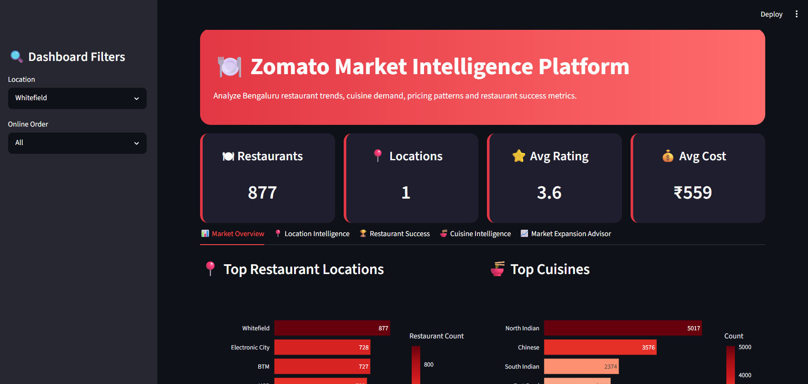
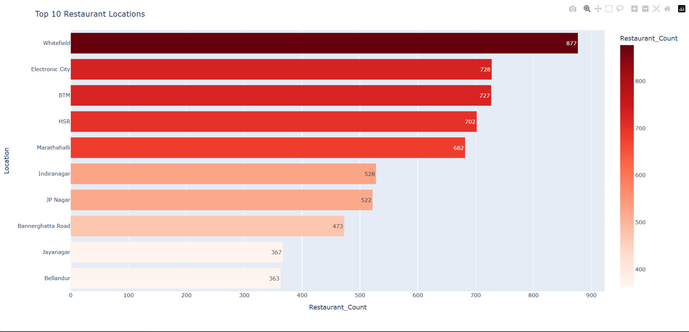
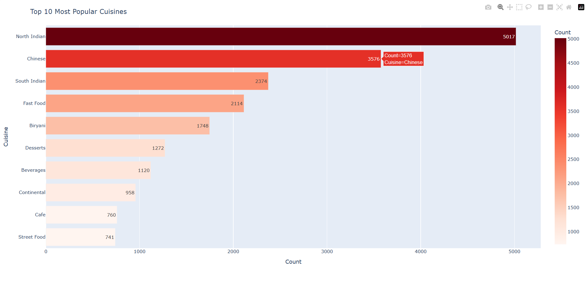

🍽️ Zomato Market Intelligence Platform

📌 Overview

The Zomato Market Intelligence Platform is an end-to-end Data Science and Business Intelligence project developed using Python, Machine Learning, and Streamlit.

The platform analyzes restaurant data from Bengaluru to identify market trends, customer preferences, pricing strategies, restaurant success factors, and optimal expansion locations.

🚀 Features:

Data Analysis
Data Cleaning
Exploratory Data Analysis (EDA)
Feature Engineering
Customer Sentiment Analysis
Restaurant Clustering
Machine Learning
Restaurant Rating Prediction
Success Score Calculation
Market Expansion Recommendation Engine
Interactive Dashboard
Market Overview
Location Intelligence
Restaurant Success Analysis
Cuisine Intelligence
Market Expansion Advisor

📊 Key Insights
Most Popular Cuisines
North Indian
Chinese
South Indian
High Potential Locations
Koramangala
Indiranagar
Lavelle Road
MG Road
Success Drivers
Customer Ratings
Number of Votes
Online Ordering Availability
Pricing Strategy

🤖 Machine Learning Performance
Metric	Value
MAE	0.241
RMSE	0.333
R² Score	0.416

🛠 Tech Stack
Programming
Python
Data Analysis
Pandas
NumPy
Visualization
Plotly
Matplotlib
Seaborn
Machine Learning
Scikit-Learn
Random Forest Regressor
NLP
TextBlob
Dashboard
Streamlit

📂 Project Structure
Zomato-Market-Intelligence
│
├── dashboard/
│   └── app.py
│
├── data/
│   ├── raw/
│   └── processed/
│
├── models/
│   └── rating_model.pkl
│
├── notebooks/
│   ├── 01_data_cleaning.ipynb
│   ├── 02_eda.ipynb
│   ├── 03_feature_engineering.ipynb
│   ├── 04_sentiment_analysis.ipynb
│   ├── 05_clustering.ipynb
│   ├── 06_ml_rating_prediction.ipynb
│   └── 07_business_insights.ipynb
│
└── src/
    ├── clustering.py
    ├── data_cleaning.py
    ├── feature_engineering.py
    ├── model_training.py
    ├── recommender.py
    ├── sentiment_analysis.py
    └── utils.py
▶️ Run Locally
git clone <repository-url>

cd Zomato-Market-Intelligence

pip install -r requirements.txt

streamlit run dashboard/app.py
👨‍💻 Author

Jestin Thomas

Data Science
Machine Learning
Business Intelligence
Data Analytics
4. Create LICENSE

Create LICENSE

Choose:

MIT License

You can use the standard MIT template.

5. Git Commands
git init

git add .

git commit -m "Completed Zomato Market Intelligence Platform"

git branch -M main

git remote add origin <YOUR_GITHUB_REPO_URL>

git push -u origin main

## 📸 Project Screenshots

### Dashboard Overview

Interactive Streamlit dashboard with KPI cards, filters and business insights.

---

### Location Intelligence

Identifies restaurant hotspots across Bengaluru.

---

### Cuisine Intelligence

Analyzes cuisine demand and customer preferences.

---

### Market Expansion Advisor

Recommends optimal locations for opening a new restaurant based on cuisine and budget.

